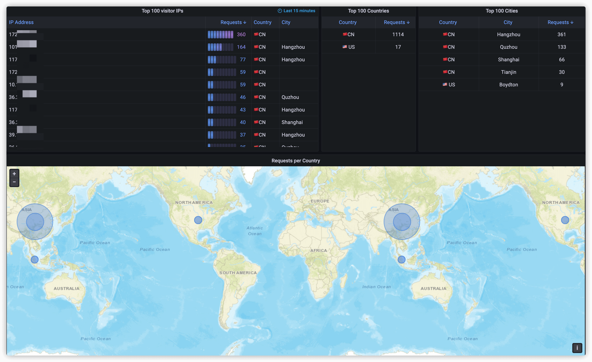

# grafana loki dashboard for nginx

## Usage

### Enable [Geoip2](https://github.com/leev/ngx_http_geoip2_module)

If you want to count the requested geographic location information, you may need to enable the `geoip` or `geoip2` module.

How to enable the `geoip` or `geoip2` module will not be repeated here.

You can refer to the [official documentation](https://github.com/leev/ngx_http_geoip2_module#example-usage) for related configuration.

## Reference

- [Grafana Loki Dashboard for NGINX Service Mesh](https://grafana.com/grafana/dashboards/12559)